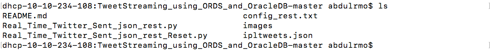
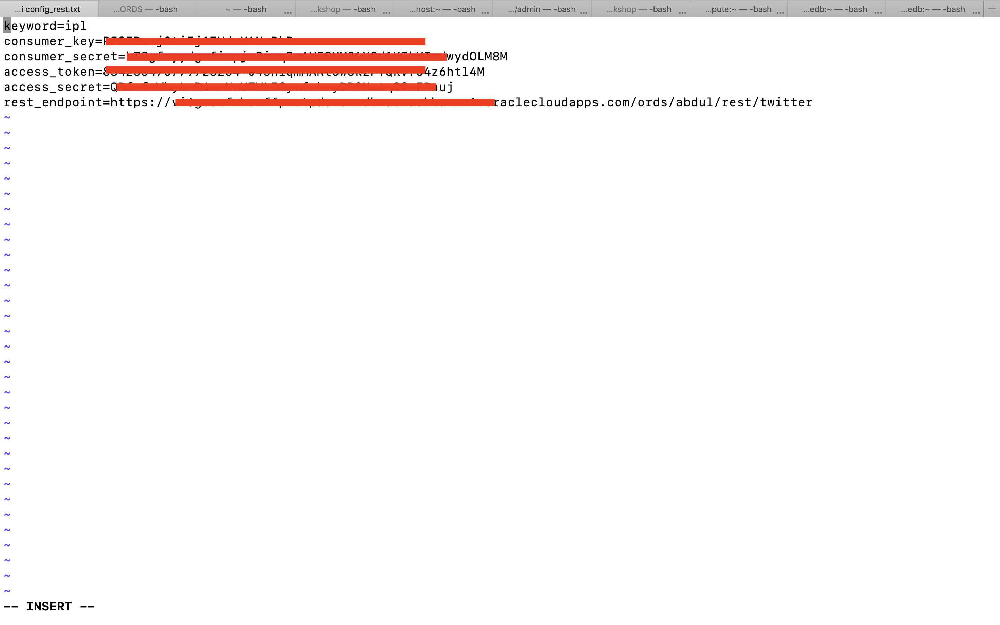
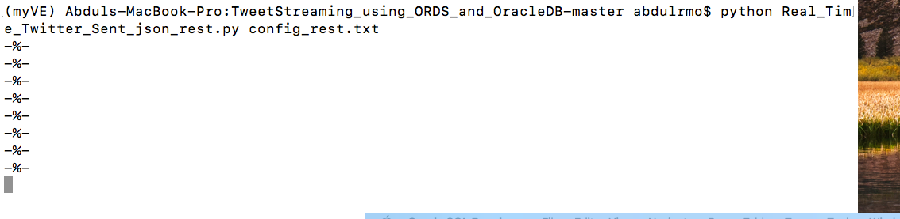
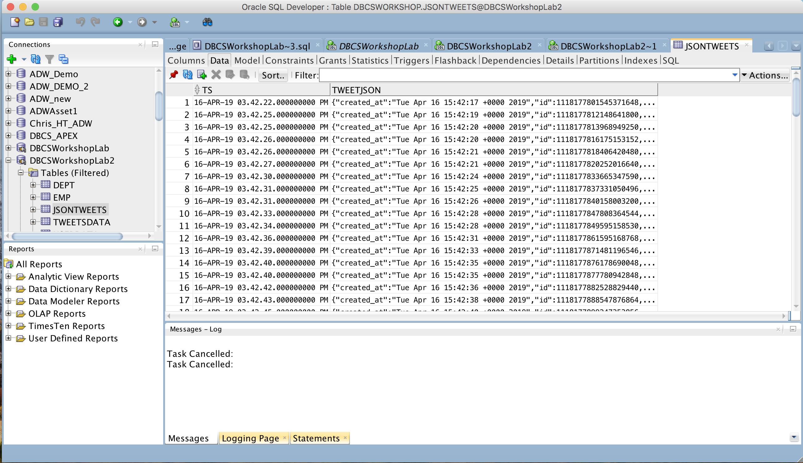

<table class="tbl-heading"><tr><td class="td-logo">

Nov 6, 2019
</td>
<td class="td-banner">
# Lab 4: Using the REST Service on Oracle ATP to load data from Python Application to Oracle ATP
</td></tr><table>

## Introduction

In this lab, you will be installing a python application and using the REST service you created in the previous lab to load data into the Oracle Database you created in Lab 100.

You can load data into Oracle Database by multiple methods but REST service provides ease of use for the developer and is easily integratable with most of the applications.

You can load data:
- By creating connection to database in the application.
- By using REST service created on Oracle Database.

This lab shows how to integrate the REST service with the Python application and use it to load data from Python Application to Oracle Database.

To **log issues**, click [here](https://github.com/Abdul-Rafae-Mohammed/StepByStepGuideToSetupPythonAppWithOracleATP/issues/new) to go to the github oracle repository issue submission form.

## Objectives

- Learn how to use the REST service on ATP database and integrate them with the applications.
- Verify the data being loaded in the database using SQL Developer

## Required Artifacts

- Please ensure you completed the guide 100 before you start this lab. Refer <a href="./Guide100Create_a_RestService_on_ATP.md" target="_blank">Guide100.md</a>
- You have installed Oracle SQL Developer. You can download SQL Developer 18.3 [here](https://www.oracle.com/technetwork/developer-tools/sql-developer/downloads/index.html) and follow the instructions to complete the installation.

## Steps

### **STEP 1: Download the Python Application**

- For this lab, you will need an application which we can integrate with the REST Service. For the purpose of this lab you can download the application available in the following repository.  Click <a href="https://github.com/Abdul-Rafae-Mohammed/TweetStreamingusingPythonintoOracleDBusingORDS.git" target="_blank">here</a> to download a zipfile of the Python Application. Unzip it to a directory on your machine.

You will see:
- Python Application: **Real_Time_TweetStreaming_using_Rest_Service.py**
- Config file: **config_rest.txt**

 

### **STEP 2: Setting up the configuration file for the Python App**

- The Python Application you installed is going to download the tweets from twitter based on the keyword you provide and store them in JSON format in the Oracle Database you created in Lab 100.

- Since, JSON is natively supported by the Oracle Database. You dont have to worry about reformatting the JSON object or parsing the JSON object to extract the data and then store it. You can directly store the JSON objects in the Oracle database.


- Now, Modify the application config to work with your environment.

- Navigate to the folder where you have unzipped the application.

- open the config file

    ```
    vi config_rest.txt
    ```

- change all the parameters based on your environment.

    ```
    keyword=<Keyword>
    consumer_key=<Twitter Account Consumer Key>
    consumer_secret=<Twitter Account Consumer Secret>
    access_token=<Twitter Account Access Token>
    access_secret=<Twitter Account Access Secret>
    rest_endpoint=<REST End Point Full URL>
    ```

    

 Note that for getting the twitter authentication details, you need to have a twitter account and create an app on twitter from which the python application can retrieve tweets. To setup your twitter account please follow the steps on this <a href="https://docs.inboundnow.com/guide/create-twitter-application/" target="_blank">link</a>.

### **STEP 3: Running the Python App**

- Make sure you are in the folder with the Python App.

- Run the Python App.

    ```
    python Real_Time_TweetStreaming_using_Rest_Service.py config_rest.txt
    ```


- Verify the script output. the Application is going to print a "-%-" on screen each time a tweet is being stored in the database. 

    

- verify that the tweets are being stored in the database by connecting to the database, using SQL Developer, as the same user for which you created the REST Service.

    


- Now you have successfully used the REST service you created with an Application.

-  In the next Lab you are going to see how Oracle database makes this data which is being stored by the application easily accessible and useful for the Data Analysts without having them to put effort into parsing the data from the JSON objects.

-   You are now ready to move to the next lab.

<table>
<tr><td class="td-logo">[](#)</td>
<td class="td-banner">
## Great Work - All Done!
</td>
</tr>
<table>